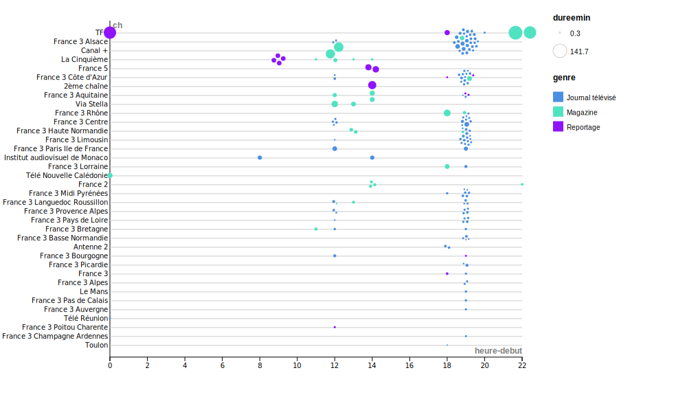

# Médecines Alternatives sous les Projecteurs : Évolution, Perceptions et Cadre Réglementaire (1965-2023)

# Sommaire 
1. [Introduction](#introduction)
2. [Présentation du corpus](#Présentation-du-corpus-:)
4. [Présentation des jours de pics de diffusion](#Présentation-des-jours-de-pics-de-diffusion-:)
5. [Analyse visualisation des pics d’audience de diffusion d’émission tout au long de la journée](#Analyse-visualisation-des-pics-d’audience-de-diffusion-d’émission-tout-au-long-de-la-journée)
6. [Corona Virus & les médecines Alternatives](Corona-Virus-&-les-médecines-Alternatives-:)
7. [Conclusion](#Conclusion)
# Introduction

Les médecines alternatives, regroupant une gamme diversifiée de pratiques thérapeutiques en dehors des normes médicales conventionnelles, ont captivé l'attention du public et des médias. De l'acupuncture à l'homéopathie, ces approches offrent des solutions holistiques pour traiter une variété de maux physiques et mentaux. Cependant, la représentation de ces médecines dans les médias suscite des interrogations quant à leur perception et leur intégration dans la société. Comment les médecines alternatives sont-elles présentées et discutées dans les médias, et quel impact cela a-t-il sur leur acceptation, leur usage et leur régulation ?

Cette problématique soulève l'enjeu crucial de comprendre comment les médias façonnent la perception et la légitimité des médecines alternatives. En analysant les discours médiatiques, nous pourrons mieux saisir les tendances, les biais et les enjeux entourant leur représentation dans l'espace médiatique contemporain. Cette exploration nous permettra d'éclairer les interactions complexes entre les médecines alternatives et les médias, et d'appréhender leur impact sur la santé publique et les choix thérapeutiques des individus.

# Présentation du corpus :

Dans le cadre de notre recherche axée sur l'étude et l'analyse des médecines alternatives, le jeu de données "corpus9_meddouce.csv" fournit par les chercheurs de l'inathèque  compile une diversité d'informations provenant de journaux télévisés, reportages télévisés et magazines. Ces données offrent une vue complète sur les pratiques de médecines douces, allant de l'homéopathie à la médecine naturelle, en passant par d'autres approches alternatives de soins. Le corpus englobe un large éventail de sujets, notamment la réglementation, la création de labels pour les médecines douces, les témoignages de professionnels, ainsi que des événements historiques et contemporains liés à ce domaine.
En outre, le corpus contient des informations détaillées sur des reportages portant sur les médecines alternatives aux États-Unis et en France, des expositions dédiées aux médecines douces à Paris, ainsi que des discussions sur des pratiques spécifiques telles que l'ostéopathie et l'homéopathie. Ces données fournissent une perspective approfondie sur les médecines alternatives et leur impact sociétal, offrant ainsi une base solide pour une analyse exhaustive dans le cadre de notre projet de recherche à l'INATEQUE.
Avant d'entamer notre analyse qualitative et quantitative du corpus, nous avons entrepris l'étape de filtrage des données en utilisant différents outils tels qu'OpenRefine, Python et des tableurs pour le langage Ere. Ces outils ont été essentiels pour nettoyer et organiser les informations extraites du jeu de données, améliorant ainsi leur qualité et leur pertinence pour l'analyse ultérieure.

Notre premier processus de filtrage a consisté à trier les descripteurs en utilisant un script Python pour les séparer individuellement et les classer par ordre décroissant d'occurrences. Cette méthode de filtrage nous a permis d'identifier les descripteurs les plus pertinents, facilitant ainsi la sélection des ressources à explorer pour répondre à notre problématique et à nos questions de recherche. En isolant les références les plus significatives, ce processus a facilité notre sélection des ressources à examiner pour aborder notre question de recherche et les diverses questions associées. Nous avons donc réduit notre corpus initial de 800 notices à un corpus de 160 notices qui traitent des sujets plus pertinents pour notre problématique, tels que la médecine douce, la santé, l'homéopathie, l'acupuncture, les salons, l'ostéopathie et la relaxation. 
<iframe src='https://flo.uri.sh/visualisation/17045471/embed' title='Interactive or visual content' class='flourish-embed-iframe' frameborder='0' scrolling='no' style='width:100%;height:600px;' sandbox='allow-same-origin allow-forms allow-scripts allow-downloads allow-popups allow-popups-to-escape-sandbox allow-top-navigation-by-user-activation'></iframe>

## Exploration des Médecines Alternatives à travers le Prisme Médiatique : Diversité, Promotion et Controverse

- **Diversité des pratiques :** Les vidéos montrent une diversité de pratiques de médecine alternative telles que le magnétisme, l'homéopathie, l'hypnose et l'ostéopathie. Ces différentes approches sont présentées dans les médias, démontrant la variété des options disponibles pour les patients.

- **Promotion et Valorisation :** Certaines vidéos mettent en avant les bénéfices perçus des médecines alternatives, avec des témoignages de patients et des cas de succès. Ces reportages peuvent contribuer à promouvoir ces pratiques en les présentant comme des solutions efficaces et accessibles.

- **Controverse et Critique :** D'autres vidéos soulèvent des questions sur l'efficacité, l'éthique et la sécurité des médecines alternatives. Par exemple, le déremboursement de l'homéopathie et les cas de condamnation de praticiens pour abus mettent en lumière les controverses entourant ces pratiques.

- **Représentation Médiatique :** Les médias jouent un rôle crucial dans la représentation et la diffusion des médecines alternatives. En montrant différents aspects de ces pratiques, les médias contribuent à façonner l'opinion publique et à influencer les politiques de santé.

- **Impact sur l'Opinion Publique :** La manière dont les médecines alternatives sont présentées dans les médias peut influencer l'opinion publique et les décisions politiques. Par exemple, le débat sur le déremboursement de l'homéopathie reflète les discussions en cours dans la société et les médias sur l'efficacité de cette pratique.

Ce panorama des médecines alternatives à travers le prisme médiatique met en lumière l'importance de comprendre comment ces pratiques sont présentées et perçues dans l'espace public. La diversité des approches médicales alternatives, leur promotion dans les médias et les débats autour de leur efficacité soulignent l'ampleur de l'intérêt et des préoccupations entourant ce domaine. En examinant de près la manière dont les médias abordent ces questions, il est possible de mieux comprendre comment ces pratiques sont intégrées dans le paysage de la santé contemporain et comment elles influencent l'opinion publique et les politiques de santé. Ainsi, cette exploration offre un éclairage précieux sur les défis et les opportunités liés à la reconnaissance et à l'intégration des médecines alternatives dans le système de santé moderne.

## Évolution et médiatisation de la médecine alternative : Analyse du pic de 2017 et comparaison des discours médiatiques

## Pic en 2017

La médecine alternative a connu plusieurs évolutions au fil des années. En effet, les recherches que nous avons menées nous ont permis d'observer les pics d'évolution les plus marquants dans la sphère médiatique. Parmi ceux-ci, l'année 2017 se démarque particulièrement. Nous avons donc entrepris des investigations dans et hors corpus, afin de comprendre les raisons de cette médiatisation plus importante à cette période. Bien entendu, plusieurs hypothèses ont été émises pour expliquer ce phénomène.

**Les  hypothèses sur ce pic sont les suivantes ;**
1. L'intérêt croissant pour les médecines alternatives en France pourrait être attribuable à une recherche croissante de solutions de santé naturelles et holistiques.
2. L'augmentation du nombre de professionnels de la santé intégrant des pratiques alternatives dans leur approche thérapeutique pourrait répondre à une demande croissante de soins personnalisés et complémentaires.
 **Les raisons pourraient donc être les suivantes**
- Loi "Ma Santé 2022" : Lancement du plan gouvernemental visant à promouvoir les médecines complémentaires et alternatives, dont la médecine douce, pour améliorer l'accès aux soins de santé.
- Une étude de prévalence a révélé une augmentation du nombre de médecins généralistes ayant une formation complémentaire aux médecines alternatives et complémentaires, avec une proportion significative pratiquant l'homéopathie, l'ostéopathie, l'acupuncture et la mésothérapie.
- Des chercheurs de l'université Yale ont souligné les risques associés à l'utilisation exclusive de remèdes alternatifs pour traiter le cancer. Leur étude a montré que les patients optant uniquement pour des médecines alternatives avaient un risque de décès plus élevé que ceux suivant des traitements conventionnels.

>> Sources :
>> [Radio France](https://www.radiofrance.fr/franceculture/podcasts/la-science-cqfd/medecines-alternatives-mieux-vaut-prevenir-que-guerir-3582795)
>> [Cairn](https://www.cairn.info/revue-hegel-2017-1-page-93.htm)
>> [Le Point](https://www.lepoint.fr/sante/cancer-les-medecines-alternatives-augmentent-le-risque-de-deces-18-08-2017-2150887_40.php)

Nous avons également observé, à travers ce graphique deux grands pics, avant et après les années 2000, représentant une évolution des discussions autour de la médecine alternative. Au début des années 1900, cet aspect de la médecine suscitait un intérêt limité dans les médias, avec peu de contenu lui étant spécifiquement consacré. Cependant, au fur et à mesure que les décennies ont avancé, l'intérêt pour cette branche non conventionnelle de la médecine a progressivement augmenté.

Une question essentielle qui a émergé était celle concernant la nature du contenu diffusé par les médias en général sur la médecine alternative : s'agissait-il de promotion, de critique, ou d'une approche plus neutre ?

## Comparaison des discours médiatiques avant et après les années 2000

    
    

## Avant les années 2000

Au cours de notre analyse, nous avons constaté une évolution du discours autour de la médecine alternative, ainsi que des débats concernant sa légitimité en termes de remboursement. Dans les années 1900, la médecine alternative était perçue comme un moyen potentiel de soulager économiquement la sécurité sociale. En effet, certains la considéraient comme une opportunité de réduire les coûts associés à l'achat de médicaments, ce qui aurait entraîné une baisse des dépenses pour la sécurité sociale.
Dans un reportage de l'époque, un praticien chiropratique affirmait que "la sécurité sociale croulait alors (en 1971) sous le poids des coûts des médicaments", et que les praticiens de la médecine alternative venaient "à point nommé pour la soulager". De plus, les discours de cette période insistaient sur les bienfaits de la médecine alternative, la présentant comme complémentaire à la médecine traditionnelle. Son développement était considéré comme une opportunité de soulager les patients souffrant de maladies que la médecine conventionnelle ne parvenait pas à guérir, tout en réduisant la dépendance aux médicaments. Des médias tels que TF1 et France 3 Alsace ont ainsi relayé les succès et les avantages de la médecine alternative.

## Après les années 2000

À partir des années 2000, on constate un changement de ton pour certains médias, tandis que d'autres maintiennent leur ligne éditoriale concernant la médecine alternative. Sur TF1, la perception de la médecine alternative a connu une détérioration. Le discours critique s'est développé, mettant en doute l'efficacité de cette approche et soulignant l'absence de preuves scientifiques à son soutien. De plus, l'absence de cadre réglementaire encadrant la médecine alternative a été soulignée. Dans un reportage, il a été mentionné que tout le monde pouvait se proclamer praticien dans ce domaine, que les formations étaient disponibles en ligne, et que ce secteur demeurait non réglementé.
En revanche, France 3 Alsace a maintenu une ligne éditoriale similaire à celle des années 1900, en continuant de promouvoir la médecine alternative et en plaidant pour sa prise en charge et son remboursement. En 2021  durant le journal télévisé, la chaine régionale a encore mis en avant le taux de rétablissement de 70% des patients d'un centre de santé en seulement une semaine grâce à cette pratique. Ils ont également évoqué la bio cinématique comme une approche complémentaire à la kinésithérapie.

Cette comparaison met en lumière les divergences dans les perspectives médiatiques sur la médecine alternative, reflétant les débats et les évolutions socio-culturelles entourant cette pratique au fil du temps.

Par ailleurs, nous nous sommes intéressés à la place de la médecine alternative au sein des médias en termes d’heure de diffusion et de jours de diffusion pour identifier le public cible et le degré d’importance accordé au sujet. 

## France 3 Alsace :

Les analyses quantitatives réalisées nous ont permis d'observer que la chaine France 3 ALsace arrive en tête des chaines diffusant des programmes sur la médecine alternative. Nous avons donc, formulé des hypothèses pour répondre à cette observation : 
1. L'intérêt croissant du public alsacien pour les médecines alternatives a probablement incité France 3 Alsace à proposer une couverture étendue de ces sujets pour répondre à cette demande locale.
2. L'intégration progressive de l'acupuncture dans le système de santé français a pu motiver la chaîne à mettre en avant ces pratiques pour informer et sensibiliser le public sur ces options thérapeutiques.
-**Intérêt régional pour les pratiques médicales alternatives**: L'engouement des habitants de l'Alsace pour les médecines alternatives et complémentaires a pu influencer la chaîne à couvrir davantage ces sujets pour répondre à cette demande locale.
-**Intégration croissante de l'acupuncture dans le système de santé français**: La montée en popularité de l'acupuncture en France et son intégration progressive dans les pratiques médicales conventionnelles ont probablement motivé France 3 Alsace à mettre en avant ces approches.
-**Émergence de plateformes en ligne facilitant l'accès aux praticiens de médecines douces** : Le développement de plateformes en ligne permettant un accès plus facile aux praticiens de médecines douces en Alsace et Lorraine a pu renforcer l'intérêt pour ces pratiques, influençant ainsi la programmation de la chaîne.

>> Sources: https://www.jds.fr/television-127_T https://france3-regions.francetvinfo.fr/grand-est/direct/alsace
>>> https://france3-regions.francetvinfo.fr/grand-est/alsace/cancerologue-il-se-bat-pour-soigner-les-malades-grace-aux-medecines-douces-2852303.html
>>> https://www.cairn.info/revue-gouvernement-et-action-publique-2019-3-page-59.htm

<iframe src='https://flo.uri.sh/visualisation/17060056/embed' title='Interactive or visual content' class='flourish-embed-iframe' frameborder='0' scrolling='no' style='width:100%;height:600px;' sandbox='allow-same-origin allow-forms allow-scripts allow-downloads allow-popups allow-popups-to-escape-sandbox allow-top-navigation-by-user-activation'></iframe>

# Présentation des jours de pics de diffusion :

<iframe src='https://flo.uri.sh/visualisation/17059750/embed' title='Interactive or visual content' class='flourish-embed-iframe' frameborder='0' scrolling='no' style='width:100%;height:600px;' sandbox='allow-same-origin allow-forms allow-scripts allow-downloads allow-popups allow-popups-to-escape-sandbox allow-top-navigation-by-user-activation'></iframe>

Les jours où on constate des pics de diffusion sont le vendredi, le samedi et le mardi. 
Les **vendredis et samedis** sont les deux jours de la semaine où moins de gens regardent la télévision : face à ces observations, on pourrait alors envisager que les médias ne perçoivent pas la médecine alternative comme un sujet suffisamment attractif ou pertinent pour attirer une audience importante donc ils préfèrent diffuser des émissions en début de week-end. 

Néanmoins on observe un pic le **mardi**, un des jours de la semaine où les gens regardent le plus la télévision. Ce qui change la donne au final, on peut se dire que d'autres facteurs peuvent rentrer en cause pour expliquer cela : 
1. L'engouement de la médecine alternative par les médias avec l'augmentation de personnes se spécialisant dans cette médecine, ce qui suscite un certain regard de la part des médias.
2. Les nombreuses émissions sur la légitimité ou non de la médecine alternative, avec comment le gouvernement a traité le sujet comme avec la loi "*Ma Santé 2022*" ou bien le déremboursement de l'homéopathie qui a manqué de prouver son efficacité. 
Ces raisons pourraient expliquer un intérêt des médias à en parler.

<iframe src='https://flo.uri.sh/visualisation/17060007/embed' title='Interactive or visual content' class='flourish-embed-iframe' frameborder='0' scrolling='no' style='width:100%;height:600px;' sandbox='allow-same-origin allow-forms allow-scripts allow-downloads allow-popups allow-popups-to-escape-sandbox allow-top-navigation-by-user-activation'></iframe>

Suivant le précédent graphique, on peut souligner également à travers ce graphique, que le canal de diffusion le plus fréquent sur les médecines alternatives sont les journaux télévisés. Dans les journaux télévisés, il faut diffuser un maximum d'information en 25 à 30 minutes. C'est ainsi qu'on va privilégier des informations qui suscitent l'intérêt du public sur plusieurs critères : 

- **L'ancrage dans l'actualité** : on va privilégier des informations qui se passent sur le moment comme le cas du déremboursement total de l'homéopathie en 2021.

Source : [Le site du gouvernement](https://www.gouvernement.fr/actualite/deremboursement-des-medicaments-homeopathiques#:~:text=Ce%20contenu%20a%20%C3%A9t%C3%A9%20publi%C3%A9,du%20Premier%20ministre%2C%20%C3%89douard%20Philippe.&text=Les%20m%C3%A9dicaments%20hom%C3%A9opathiques%20ne%20seront,compter%20du%201er%20janvier%202021)

- **Sujet qui suscite des bouleversements aux yeux du public** : On va privilégier des informations qui peuvent avoir des répercussions dans notre quotidien, par exemple la montée de médecins généralistes qui font des formations complémentaires dans la médecine alternative. Cela peut être intéressant puisque beaucoup de personnes pourraient être intéressés par ces médecines et pourraient demander à en faire usage auprès de leur médecin traitant par exemple. 

# Analyse visualisation des pics d’audience de diffusion d’émission tout au long de la journée

Le graphique permet de repérer facilement les moments où les émissions traitant de la médecine alternative sont le plus souvent diffusées tout au long de la journée. Chaque point représente une émission alignée à sa chaîne de télévision représentée à la verticale. Les points plus gros représentent les émissions plus longues. Les couleurs indiquent le type d'émission (se référer à la légende).

Les catégories d'émissions ont été consolidées afin de réduire la dispersion des données dans le graphique. Pour certaines émissions, plusieurs genres étaient attribués, donc j'ai choisi de supprimer certains genres pour n'en garder qu'un par colonne. Cette démarche vise à offrir une visualisation plus claire et significative, évitant ainsi la dispersion des résultats. 
 
On analyse en premier lieu les **pics d’audience** : 

Là où on voit un grand nombre d’émissions diffusées c’est des créneaux entre **18h et 20h** et ça sur toutes les chaînes, horaires auxquelles les gens assistent le plus à la télévision, les gens rentrent du travail et de l’école et ont donc plus de temps à consacrer à regarder la télévision. Le type d’émission sont en majorité des journaux télévisés. Les émissions sont plutôt courtes au vu des petits points. La durée courte de ces émissions est en raison du format des émissions qui sont pour la majorité des journaux télévisés où il faut parler de plusieurs sujets sur un temps d’horaire limité. Ce que cela montre c'est que les médias cherchent à atteindre une audience maximale et estiment que le sujet est pertinent pour cette audience. 

On voit également une tendance à partir de **12h jusqu’à 14h** : une horaire connue pour être creuse, en général on considère que les gens sont au travail donc ne regardent pas la télé mais on néglige aussi que ce sont des créneaux où des femmes au foyer, des personnes au chômage et des retraités sont présents à la télé, d’ailleurs souvent les émissions sont axés sur cette dernière démographie (les retraités). On peut alors se dire que les émissions à ces horaires-là sont visées à ces populations qui sont susceptibles au sujet et s’y intéressent, potentiellement aussi des gens habitués à ces pratiques et qui n’hésitent pas à faire appel à la médecine douce. On voit également une plus grosse variété d’émissions comme des reportages et des magazines TV qui ont d’ailleurs une plus longue durée, cela peut montrer en plus qu’on cherche vraiment à cibler ces différentes démographiques. 

Programmes entre **22h-00h** : On observe une tendance chez TF1 à diffuser des émissions longues vers cette plage horaire. En général à 00h, il n’y a pas énormément d’audience, les gens dorment donc l’attention est moindre. On n’y diffuse donc pas de programme qui risque d’intéresser un large public. Dans le cas de TF1 on a retrouvé une émission qui était un débat entre les médecins conventionnels et praticiens de la médecine alternative, les praticiens essayant de légitimer leur médecine dans une tentative de convaincre le gouvernement français de faire rembourser leur pratique donc on y débat politique. 

On remarque aussi des programmes le matin entre **8h et 10h** : ce sont en majorité des reportages. Ce sont des horaires où les gens ne sont pas susceptibles d’accorder une attention aux émissions puisque c’est le départ à l’école ou au travail. 

# Corona Virus & les médecines Alternatives : 

L'argument avancé lors du salon de Marseille, relayé par France 3, met en avant le rôle des médecines alternatives, telles que l'utilisation d'huiles essentielles, dans la prévention contre les microbes, les bactéries et les virus. Plus précisément, l'exemple cité est celui des huiles essentielles, qui sont présentées comme ayant la capacité de renforcer l'immunité de l'organisme.

Les partisans de cette approche affirment que l'usage régulier d'huiles essentielles et de médecines alternatives en générale  peut contribuer à renforcer les défenses naturelles du corps, le rendant ainsi moins susceptible d'être infecté par des agents pathogènes tels que les virus, y compris le coronavirus. Cette perspective repose sur l'idée que certaines huiles essentielles possèdent des propriétés antimicrobiennes et antivirales qui peuvent aider à protéger contre les infections.

#Conclusion

